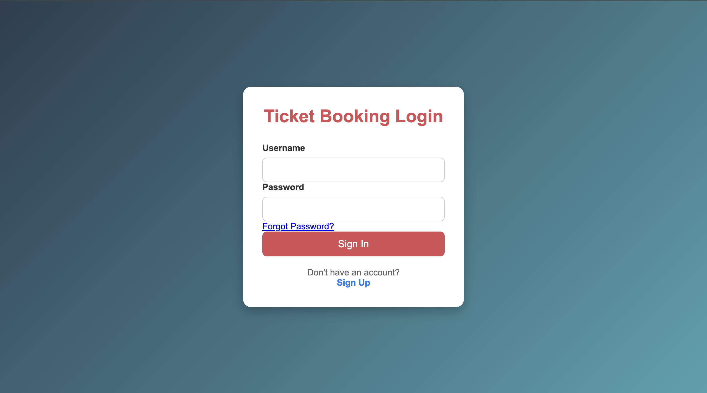
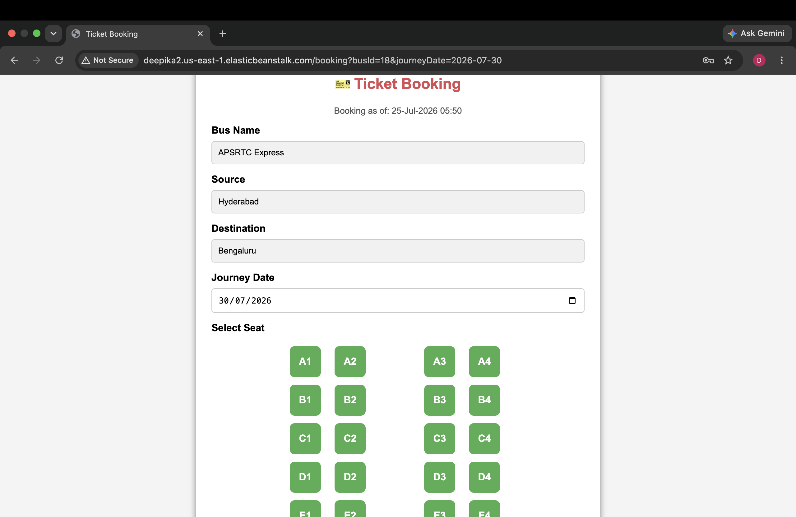
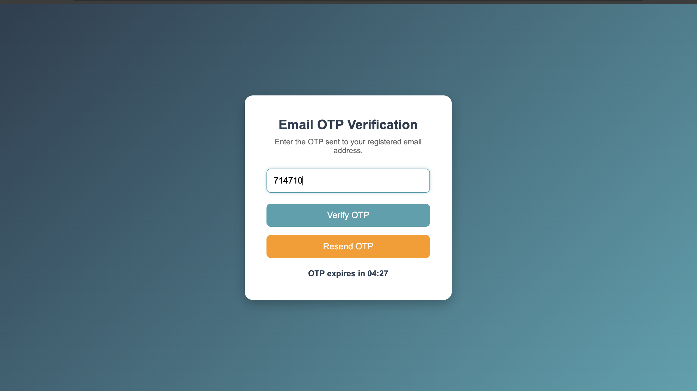
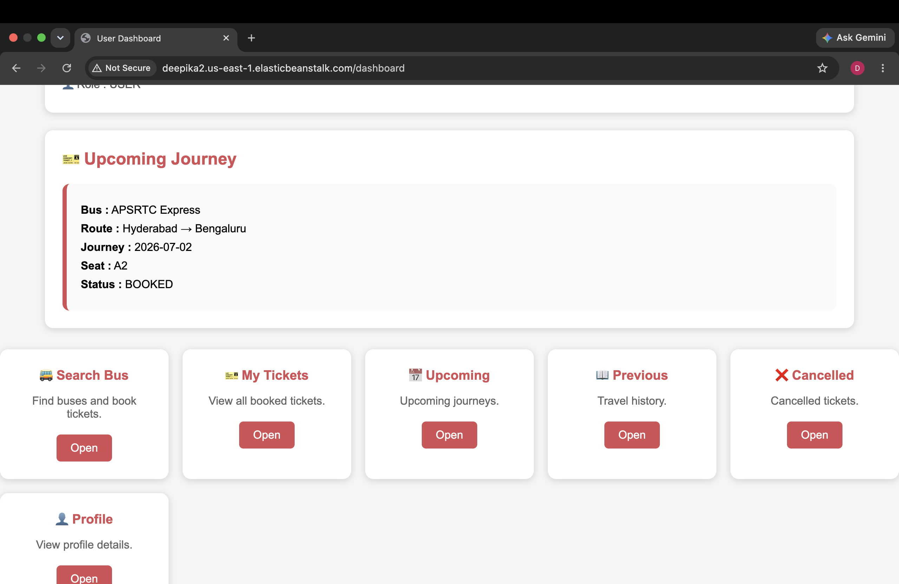
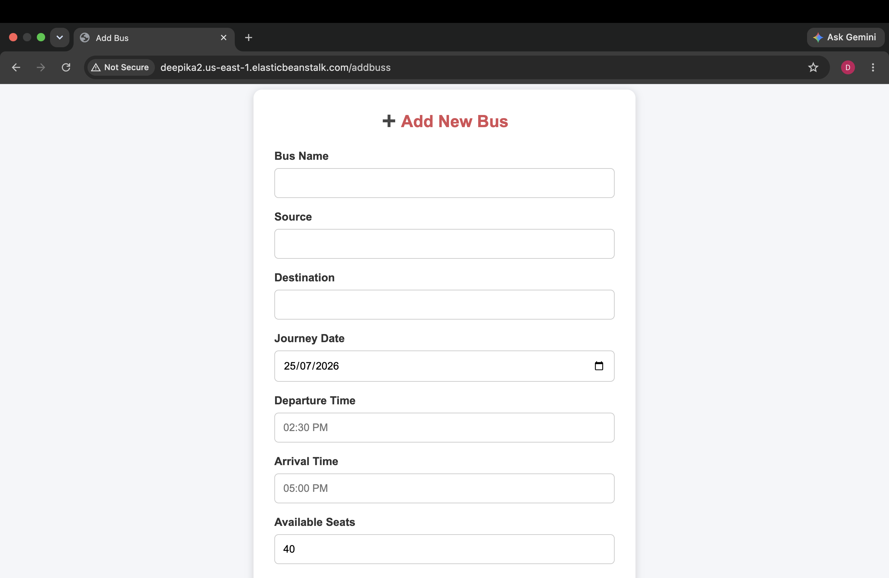
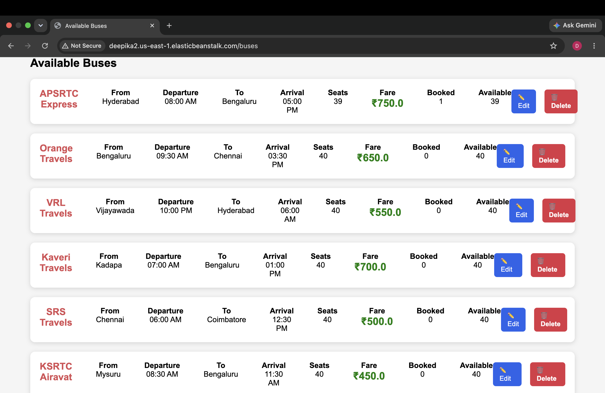
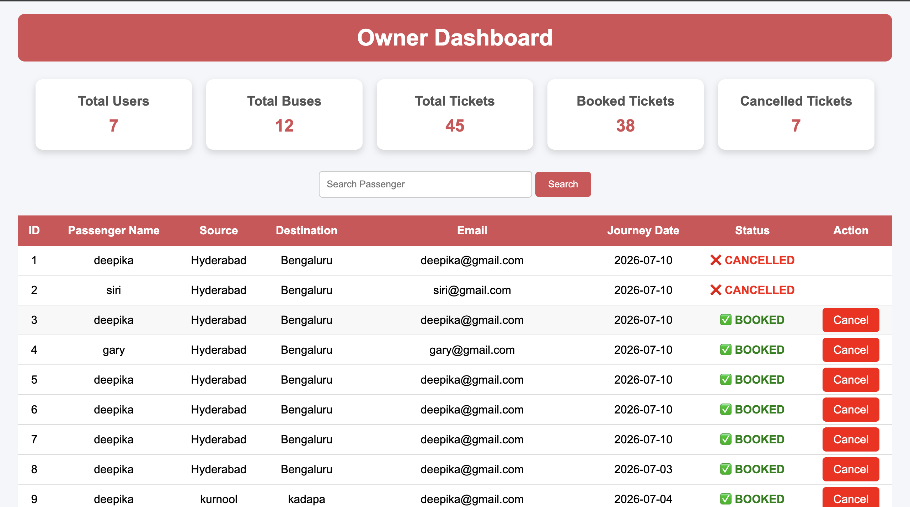
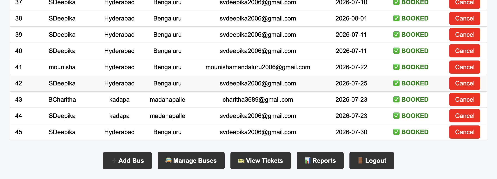

# 🚌 Online Bus Ticket Booking Application

A full-stack **Online Bus Ticket Booking Application** developed using **Java, Spring Boot, Thymeleaf, MySQL, HTML, CSS, JavaScript, Bootstrap, and AWS Elastic Beanstalk**. The application enables users to search buses, book tickets, verify bookings using OTP, receive email confirmations, and manage bookings through an intuitive interface.

---

## 🌐 Live Demo

🚀 **Application URL:**  
http://deepika2.us-east-1.elasticbeanstalk.com/

---

## 📌 Features

- 👤 User Registration & Login
- 🔍 Search Buses by Source, Destination & Travel Date
- 🚌 View Available Bus Details
- 🎫 Book Bus Tickets
- 🔐 OTP Verification
- 📧 Email Ticket Confirmation
- 📜 User Booking History
- 👨‍💼 Admin Bus Management
- 📱 Responsive User Interface

---

## 🛠️ Tech Stack

### Backend
- Java
- Spring Boot
- Spring MVC
- Spring Data JPA
- Hibernate
- Maven

### Frontend
- Thymeleaf
- HTML5
- CSS3
- JavaScript
- Bootstrap

### Database
- MySQL

### Deployment
- AWS Elastic Beanstalk

### Tools
- Spring Tool Suite (STS)
- Git
- GitHub
- Postman

---

## 📂 Project Structure

```text
Online-BusTicket-booking-Application
│
├── screenshots/
├── src/
├── pom.xml
├── README.md
└── .gitignore
```

---

## 🚀 Getting Started

### Clone the Repository

```bash
git clone https://github.com/Deepika-20061103/Online-BusTicket-booking-Application.git
```

### Navigate to the Project

```bash
cd Online-BusTicket-booking-Application
```

### Configure the Database

Create a MySQL database.

```sql
CREATE DATABASE ticketbooking;
```

Update your `application.properties` with your local MySQL and email credentials.

### Run the Application

```bash
mvn spring-boot:run
```

Open your browser and visit:

```
http://localhost:8080
```

---

## 📋 Application Workflow

1. Register or log in to the application.
2. Search buses by source, destination, and travel date.
3. Select a bus.
4. Enter passenger details.
5. Verify booking using OTP.
6. Confirm the booking.
7. Receive the ticket confirmation via email.
8. View booking history from the user dashboard.

---

## 🗄️ Database

The application uses **MySQL** as the backend database.

### Main Tables

- User
- Bus
- Ticket

The database stores:

- User account information
- Bus details
- Passenger booking details
- Ticket records

---

## 📸 Screenshots

### Login Page


---

### Search Buses


---

### Ticket Booking


---

### OTP Verification


---

### User Dashboard


---

### Add Buses


---

### Manage Buses


---

### Owner Login


---

### Owner Dashboard


---

## 🔮 Future Enhancements

- 💳 Online Payment Gateway
- 💺 Seat Selection
- 📍 Live Bus Tracking
- 📱 SMS Notifications
- 📄 PDF Ticket Download
- ❌ Ticket Cancellation & Refund
- ⭐ Bus Ratings & Reviews

---

## 👩‍💻 Author

**Deepika Somisetty**

- GitHub: https://github.com/Deepika-20061103
- LinkedIn: https://www.linkedin.com/in/venkata-deepika-devi-somisetty

---

## 📄 License

This project is created for educational and learning purposes.
